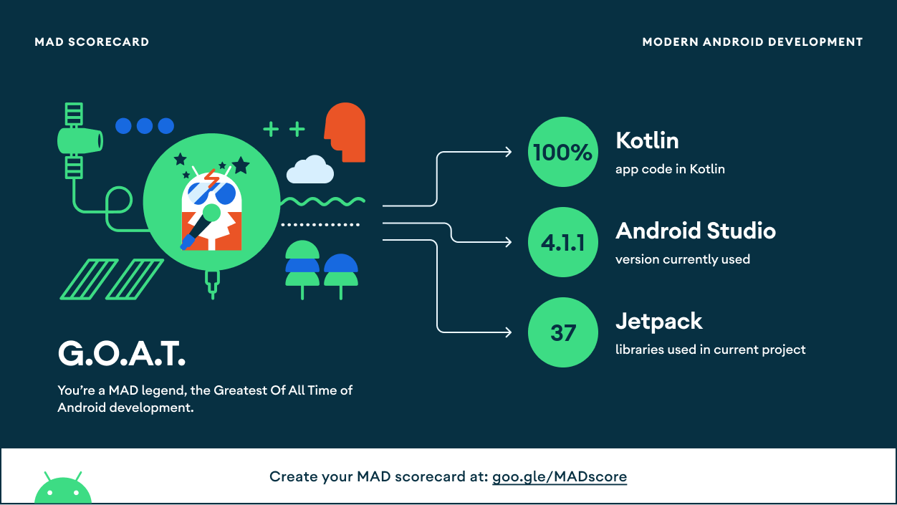
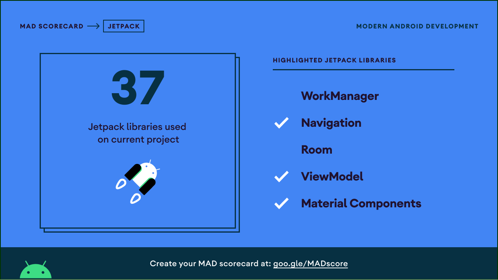

#SAMANA-USER
  

#Table Of Contents
- [Introduction](#introduction)
- [Selected Theme](#selected-theme)
- [Title](#title)
- [Demo](#demo)
- [Mad Scoreboard](#mad-scoreboard)

## Introduction

Samana project is a decision-making program concerning social assistance recipients for low-income families integrating with Mechine Learning, Cloud Computing, and Mobile Development. Samana means the breath of life from Sanskrit. During the pandemic, the poverty rate in West Java has increased. The social service hasn’t distributed social assistance appropriately, although the government has a limited budget. Mainly the current system is still manually and not integrated. From this problem statement, our research question is to determine the clustering parameters, accurately allocate low-income families, and synchronize with the database. We want to ensure the social assistance distributes to low-income families and speed up the selection process.

## Selected Theme

Economic Resilience

## Title

Decision Support System for West Java Social Assistance using the SAW and K-Means Method

## Demo

|Login Screen|Social Assistance|News|
|--|--|--|
||||

## Mad Scoreboard

    

    

    

