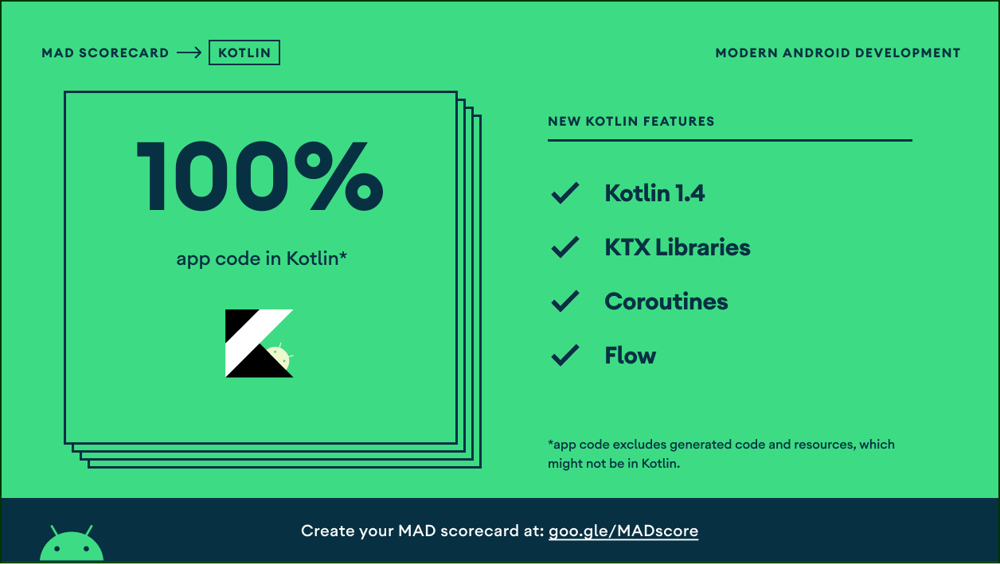

# SAMANA-USER
[](http://developer.android.com/index.html) [](http://kotlinlang.org) [](https://developer.android.com/studio/releases/gradle-plugin)

# Table Of Contents
- [Introduction](#introduction)
- [Selected Theme](#selected-theme)
- [Title](#title)
- [Usage](#usage)
- [Feature](#feature)
- [Demo](#demo)
- [Youtube](#youtube)
- [Layers](#layers)
- [Tech Stack](#tech-stack)
- [Mad Scoreboard](#mad-scoreboard)

## Introduction

Samana project is a decision-making program concerning social assistance recipients for low-income families integrating with Mechine Learning, Cloud Computing, and Mobile Development. Samana means the breath of life from Sanskrit. During the pandemic, the poverty rate in West Java has increased. The social service hasn’t distributed social assistance appropriately, although the government has a limited budget. Mainly the current system is still manually and not integrated. From this problem statement, our research question is to determine the clustering parameters, accurately allocate low-income families, and synchronize with the database. We want to ensure the social assistance distributes to low-income families and speed up the selection process.

## Selected Theme

Economic Resilience

## Title

Decision Support System for West Java Social Assistance using the SAW and K-Means Method

## Usage

1. Clone this repository, you can run it Through the android studio, or you can download the [App release](https://github.com/SAMANA-JABAR/SAMANA-USER/releases/tag/1.0.2) and install it on your mobile phone
2. Run the Application and use NIK : ```12345``` and Password : ```admin```
3. You're good to go

## Feature

- Login Feature
- Checking Social Assitance
- Input Social Assistane
- News and Details
- Change password

## Demo

|Login Screen|Social Assistance Screen|News Screen|
|--|--|--|
||||

|Profile Screen|Change Password Screen|Logout Screen|
|--|--|--|
||||

|Detail News Screen|History Screen|Input Assistance Screen|Input Assistance Next Screen|
|--|--|--|--|
|||||

## Youtube 

[](https://www.youtube.com/watch?v=SKXyoNdt_Uc)

## Layers

<p align="center">
    
</p>

- **Domain** - Contains the business logic of the application. It is the individual and innermost module. It’s a complete java module.
- **Data** It includes the domain layer. It would implement the interface exposed by domain layer and dispenses data to app
- **Presentation** - A layer that interacts with the UI, mainly Android Stuff like Activities, Fragments, ViewModel, etc. It would include both domain and data layers.

## Tech Stack

- [Clean Architecture](https://blog.cleancoder.com/uncle-bob/2012/08/13/the-clean-architecture.html) - Clean architecture is a software design philosophy that separates the elements of a design into ring levels. An important goal of clean architecture is to provide developers with a way to organize code in such a way that it encapsulates the business logic but keeps it separate from the delivery mechanism.
- [Kotlin](https://kotlinlang.org/) - First class and official programming language for Android development.
- [Coroutines](https://kotlinlang.org/docs/reference/coroutines-overview.html) - Is light wight threads for asynchronous programming
- [Flow](https://developer.android.com/kotlin/flow) Handle the stream of data asynchronously that executes sequentially.
- [Android Architecture Components](https://developer.android.com/topic/libraries/architecture) - Collection of libraries that help you design robust, testable, and maintainable apps.
   - [LiveData](https://developer.android.com/topic/libraries/architecture/livedata) - Data objects that notify views when the underlying database changes.
   - [ViewModel](https://developer.android.com/topic/libraries/architecture/viewmodel) - Stores UI-related data that isn't destroyed on UI changes.
   - [ViewBinding](https://developer.android.com/topic/libraries/view-binding) - Generates a binding class for each XML layout file present in that module and allows you to more easily write code that interacts with views.
   - [DataStore](https://developer.android.com/topic/libraries/architecture/datastore) - Jetpack DataStore is a data storage solution that allows you to store key-value pairs or typed objects with protocol buffers. DataStore uses Kotlin coroutines and Flow to store data asynchronously, consistently, and transactionally.
- [Dependency Injection](https://developer.android.com/training/dependency-injection) dependency injection is a technique whereby one object (or static method) supplies the dependencies of another object. A dependency is an object that can be used (a service).
    - [Hilt-android](https://dagger.dev/hilt/) Hilt provides a standard way to incorporate Dagger dependency injection into an Android application.
- [Retrofit](https://square.github.io/retrofit/) - A type-safe HTTP client for Android and Java.
- [Shimmer](https://github.com/facebook/shimmer-android)Android library that provides an easy way to add a shimmer effect to any view in your Android app
- [OkHttp](http://square.github.io/okhttp/) An HTTP & HTTP/2 client for Android and Java applications.
- [Gson](https://github.com/google/gson) A Java serialization/deserialization library to convert Java Objects into JSON and back
- [Glide](https://github.com/bumptech/glide) An image loading and caching library for Android focused on smooth scrolling
- [Material Design](https://material.io/develop/android/docs/getting-started) Material is a design system created by Google to help teams build high-quality digital experiences for Android, iOS, Flutter, and the web.

## Mad Scoreboard

<p align="center">
    
</p>

<p align="center">
    
</p>

<p align="center">
    
</p>

## License
```

   Copyright © 2021 SAMANA

   Licensed under the Apache License, Version 2.0 (the "License");
   you may not use this file except in compliance with the License.
   You may obtain a copy of the License at

       http://www.apache.org/licenses/LICENSE-2.0

   Unless required by applicable law or agreed to in writing, software
   distributed under the License is distributed on an "AS IS" BASIS,
   WITHOUT WARRANTIES OR CONDITIONS OF ANY KIND, either express or implied.
   See the License for the specific language governing permissions and
   limitations under the License.

```


